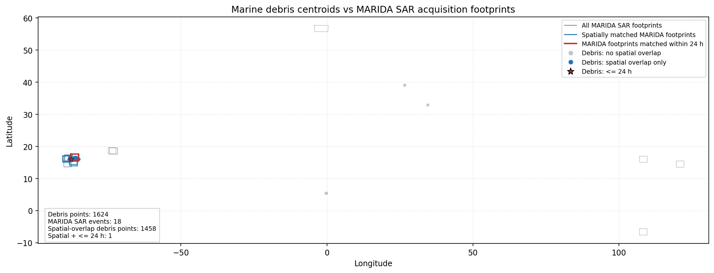
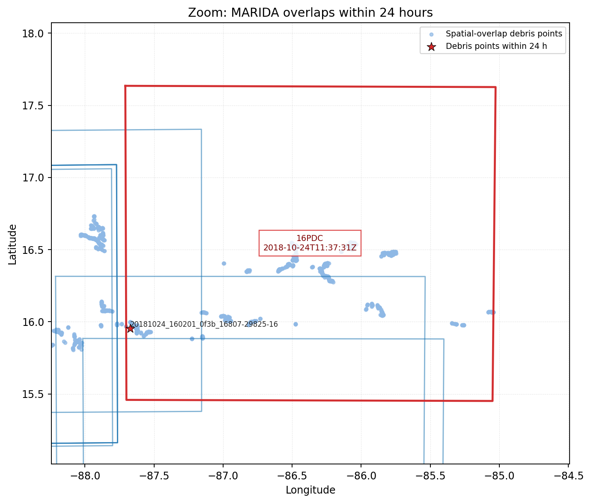

# Marine Debris vs MARIDA Overlap Report

Generated: 2026-03-18T21:15:05Z

## Inputs

- Marine debris labels: `/mnt/d/Masters/PlanetData/marine_debris/nasa-marine-debris/labels`
- MARIDA SAR root: `/mnt/d/Masters/MARIDA/downloads`

## Method

- Each labeled marine-debris polygon was reduced to a centroid point for the merged GeoJSON layer.
- Spatial overlap was tested with the original debris polygon against MARIDA SAR footprints derived from each raster's bounds and transformed to WGS84.
- Spatiotemporal overlap was defined as spatial overlap plus an absolute acquisition-time difference of at most 24 hours.

## Summary

- Marine debris label files: **739**
- Marine debris objects mapped to points: **1624**
- MARIDA SAR TIFFs: **35**
- MARIDA SAR acquisition events: **18**
- Debris points with any MARIDA spatial overlap: **1458**
- MARIDA acquisition events with any debris spatial overlap: **8**
- Debris points with spatial overlap within 24 hours: **1**
- MARIDA acquisition events with at least one <= 24 h match: **1**

## Output Files

- `marine_debris_points.geojson`
- `marine_debris_points_24h.geojson`
- `marida_sar_events.geojson`
- `marida_spatial_overlap_events.csv`
- `marine_debris_24h_matches.csv`
- `marine_debris_vs_marida_global.png`
- `marine_debris_vs_marida_24h_zoom.png`

## Maps

## Spatially Overlapping MARIDA Tiles

- `16PCC`: 6 overlapping acquisition events
- `16PDC`: 2 overlapping acquisition events

## Spatiotemporal Matches

| feature_id | source_geojson | source_acquired_utc | lon | lat | marida_tile | marida_acquired_utc | marida_sar_dir | pols | abs_delta_hours |
| --- | --- | --- | ---: | ---: | --- | --- | --- | --- | ---: |
| 20181024_160201_0f3b_16807-29825-16::feature_1 | 20181024_160201_0f3b_16807-29825-16.geojson | 2018-10-24T16:02:01Z | -87.672679 | 15.953271 | 16PDC | 2018-10-24T11:37:31Z | SAR_-4.6h | VH,VV | 4.408 |

## Spatial Overlap Event Summary

| event_id | tile | acquired_utc | sar_dir | pols | spatial_points | overlap_24h_points | min_abs_delta_h | max_abs_delta_h |
| --- | --- | --- | --- | --- | ---: | ---: | ---: | ---: |
| 16PDC_2018-10-24_SAR_-4.6h_2018-10-24T11:37:31Z | 16PDC | 2018-10-24T11:37:31Z | SAR_-4.6h | VH,VV | 994 | 1 | 4.408 | 18140.083 |
| 16PCC_2018-08-30_SAR_-4.4h_2018-08-30T11:45:46Z | 16PCC | 2018-08-30T11:45:46Z | SAR_-4.4h | VH,VV | 662 | 0 | 484.368 | 16820.220 |
| 16PCC_2018-02-21_SAR_+7.7h_2018-02-21T23:58:03Z | 16PCC | 2018-02-21T23:58:03Z | SAR_+7.7h | VH,VV | 612 | 0 | 3104.345 | 12272.425 |
| 16PCC_2020-12-12_SAR_+7.8h_2020-12-13T00:06:51Z | 16PCC | 2020-12-13T00:06:51Z | SAR_+7.8h | VH,VV | 460 | 0 | 17984.160 | 33219.562 |
| 16PCC_2018-02-26_SAR_+7.9h_2018-02-27T00:06:29Z | 16PCC | 2018-02-27T00:06:29Z | SAR_+7.9h | VH,VV | 460 | 0 | 3415.887 | 8739.556 |
| 16PCC_2017-08-30_SAR_+8.0h_2017-08-31T00:06:32Z | 16PCC | 2017-08-31T00:06:32Z | SAR_+8.0h | VH,VV | 460 | 0 | 104.429 | 10815.846 |
| 16PCC_2016-09-04_SAR_+7.9h_2016-09-05T00:06:26Z | 16PCC | 2016-09-05T00:06:26Z | SAR_+7.9h | VV | 449 | 0 | 4220.445 | 19455.847 |
| 16PDC_2018-10-24_SAR_-4.6h_2018-10-24T11:37:58Z | 16PDC | 2018-10-24T11:37:58Z | SAR_-4.6h | VH,VV | 5 | 0 | 14487.033 | 14487.033 |

## Interpretation

- The only spatiotemporal match within 24 hours is a MARIDA event in tile `16PDC` acquired at `2018-10-24T11:37:31Z`.
- All <= 24 h matches come from Planet debris labels acquired on `2018-10-24T16:02:01Z` near longitude -87.6727, latitude 15.9533.
- Spatial overlap alone is much more common because several MARIDA Honduras footprints cover the same area as the debris labels but were acquired on different days or years.
