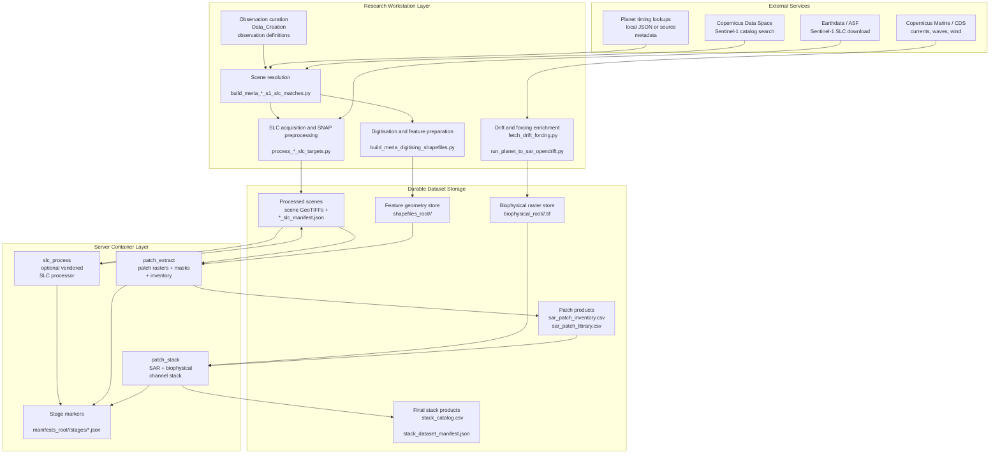
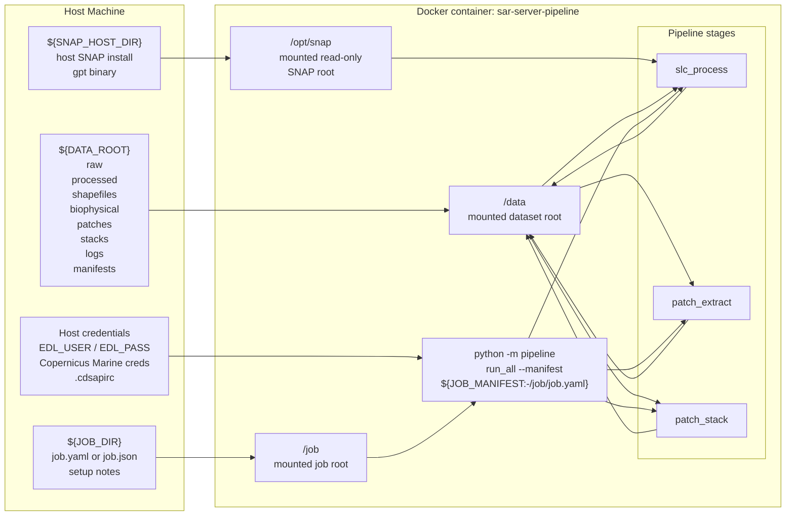
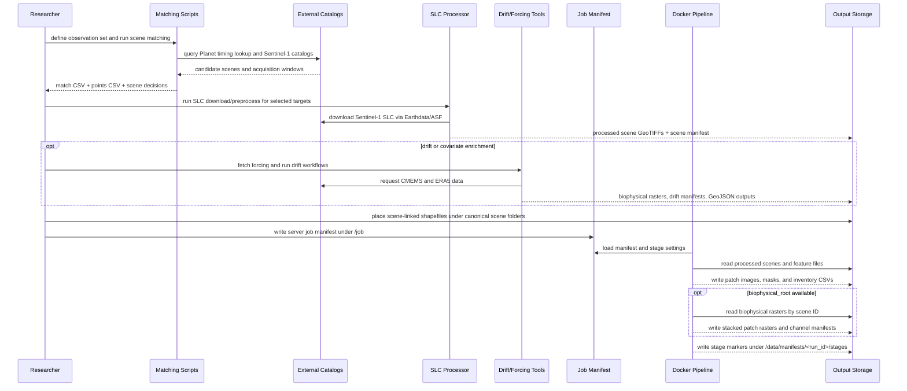

# Repository Server Architecture Design

**Date:** 2026-07-06

## Goal

Define one lifecycle-first, high-level but atomic architecture plan for the full repository, with enough technical detail to operate the server, understand the data handoffs, and reason about mounts, volumes, dependencies, and failure boundaries.

## Scope

This document covers the full end-to-end flow across the repository, not just the Dockerized server stage runner.

Included scope:

- observation and target definition
- Planet-to-Sentinel matching and scene selection
- Sentinel-1 SLC download and SNAP preprocessing
- drift forcing and OpenDrift-style trajectory generation
- digitised patch and feature-shapefile preparation
- server-side patch extraction and stack assembly
- output catalogs, manifests, and stage markers
- host/container mount contracts and external runtime dependencies

Excluded scope:

- model training architecture
- deployment orchestration beyond the single `docker compose` service already in the repo
- cloud infrastructure automation

## Intended Audiences

- research contributors who need to understand how observations become training-ready SAR patch stacks
- server and pipeline operators who need to run the container with the correct host volumes, manifests, credentials, and supporting files

## Architecture Summary

The repository implements a staged data-production system that starts from curated debris observations and ends with georeferenced multi-channel patch stacks for machine learning.

The system is split into four major operating zones:

1. `Data_Creation`
   Builds observation catalogs, resolves compatible Sentinel-1 scenes, and runs the main MERIA SLC processing workflow.
2. `Domain_SSL`
   Provides adjacent preprocessing workflows for drift-oriented scenes, forcing download, and Planet-to-SAR drift estimation.
3. `sar_server_pipeline`
   Packages the server-side execution model into a manifest-driven Docker workflow with resumable stages.
4. `workspace data roots`
   Hold the raw imagery, processed GeoTIFFs, shapefiles, biophysical rasters, inventories, and final stacked datasets.

The canonical lifecycle is:

1. observations are defined
2. Planet acquisitions are resolved and paired with acceptable Sentinel-1 scenes
3. Sentinel-1 SLC products are downloaded and preprocessed with SNAP
4. optional drift and forcing products are generated to support time-linked interpretation and extra covariates
5. digitised feature files are attached to processed scenes
6. the server pipeline extracts SAR-centered patches and rasterized masks
7. biophysical rasters are reprojected onto those patches
8. final training stacks and catalogs are written

## Major Subsystems

### 1. Observation and Scene-Matching Layer

Primary responsibilities:

- encode research observations and seed coordinates
- resolve Planet acquisition timing
- find Sentinel-1 SLC candidates near the observation date
- enforce AOI and coverage rules so scenes are relevant to the training target

Primary implementation locations:

- `D:\Masters\Data_Creation\build_meria_sa_s1_slc_matches.py`
- `D:\Masters\Data_Creation\build_meria_global_s1_slc_matches.py`
- `D:\Masters\Data_Creation\slc_match_aoi.py`
- `D:\Masters\Data_Creation\meria_planet_acquisitions.json`

Key inputs:

- curated observation coordinates
- Planet acquisition lookup JSON
- Copernicus Data Space Sentinel-1 catalog responses
- AOI coverage rules such as the 5 km buffer and minimum coverage threshold

Key outputs:

- match CSV files such as `MERIA_SA_plastic_nearest_S1_SLC_before_after.csv`
- points CSV, shapefile, and GeoPackage products
- cached catalog lookup files

Atomic contract:

- this layer decides what scene should be processed
- downstream layers should not need to rediscover scene identity

### 2. Sentinel-1 Ingestion and SNAP Processing Layer

Primary responsibilities:

- download or reuse Sentinel-1 SLC ZIP products
- unzip SAFE bundles
- run the SNAP graph chain per subswath
- export scene-level GeoTIFF features and write a scene manifest

Primary implementation locations:

- `D:\Masters\Data_Creation\process_meria_sa_slc_targets.py`
- `D:\Masters\Data_Creation\process_global_slc_targets.py`
- `D:\Masters\Data_Creation\process_sa_slc_targets.py`
- `D:\Masters\SAR_PP\graphs\*.xml`
- `D:\Masters\sar_server_pipeline\vendor\Data_Creation\*.py`
- `D:\Masters\sar_server_pipeline\docker\snap_graphs\*.xml`

Key external systems:

- ASF / Earthdata login for SLC download
- SNAP GPT executable
- Java runtime used by SNAP

Key scene products:

- `vv`
- `vh`
- `vv_refined_lee`
- `vv_glcm_mean`
- `vv_glcm_std`
- `vv_glcm_entropy`
- `decomp_entropy`
- `decomp_anisotropy`
- `decomp_alpha`

Key outputs:

- processed scene folders under a processed root
- one `*_slc_manifest.json` per scene
- scene-level single-band GeoTIFFs on a shared final grid

Atomic contract:

- one scene manifest is the handoff unit from raw SLC processing into server patch extraction
- if the scene manifest and expected outputs are complete, downstream work can proceed without re-running SNAP

### 3. Drift and Forcing Enrichment Layer

Primary responsibilities:

- fetch current, wave, and wind forcing
- generate OpenDrift-compatible forcing cubes
- estimate plastic movement between Planet and SAR times
- support time-linked interpretation and future dataset enrichment

Primary implementation locations:

- `D:\Masters\Domain_SSL\Scripts\Preprocessing\fetch_drift_forcing.py`
- `D:\Masters\Domain_SSL\Scripts\Preprocessing\fetch_accra_drift_forcing.py`
- `D:\Masters\Domain_SSL\Scripts\Preprocessing\run_planet_to_sar_opendrift.py`
- `D:\Masters\Domain_SSL\Scripts\Preprocessing\run_accra_opendrift.py`
- `D:\Masters\Domain_SSL\Scripts\Preprocessing\predict_accra_planet_drift.py`
- `D:\Masters\Domain_SSL\Scripts\Preprocessing\process_drift_slc.py`

Key external systems:

- Copernicus Marine credentials and APIs
- CDS / ERA5 access
- OpenDrift and related scientific Python stack

Key outputs:

- `cmems_currents_*.nc`
- `cmems_waves_*.nc`
- `era5_wind_*.nc`
- `opendrift_manifest.json`
- drift vector GeoJSON outputs
- predicted seed polygons or particle points

Atomic contract:

- forcing and drift products enrich interpretation and can also produce extra rasters or search geometry, but they are not required for the minimal `slc_process -> patch_extract` path
- the server `patch_stack` stage only depends on ready-to-read geospatial rasters under the configured `biophysical_root`

### 4. Digitisation and Feature Geometry Layer

Primary responsibilities:

- attach curated polygons or features to the processed SAR scene
- preserve scene-specific feature files under stable scene IDs
- provide the geometry that becomes masks and sample windows

Primary implementation locations:

- `D:\Masters\Data_Creation\build_meria_digitising_shapefiles.py`
- `D:\Masters\Data_Creation\build_meria_digitisation_tracker.py`
- digitised patch folders under processed scene directories
- copied or prepared server-side scene feature folders under shapefile roots

Key outputs:

- scene-specific `.geojson`
- scene-specific `.shp` bundles

Canonical server assumption:

- feature files are located under `shapefiles_root/<scene_id>/`

Atomic contract:

- a feature file must map cleanly to a processed scene manifest
- if a feature file exists without a matching scene manifest, patch extraction must stop

### 5. Server Patch Extraction Layer

Primary responsibilities:

- discover processed scene manifests
- match feature files to scene IDs
- select the correct raster output bundle
- extract centered SAR patches
- rasterize feature masks
- compute per-band statistics
- build patch inventory and library CSVs

Primary implementation locations:

- `D:\Masters\sar_server_pipeline\stages\patch_extract.py`

Inputs:

- processed scene manifests under `processed_root`
- scene GeoTIFF outputs referenced by those manifests
- feature geometry files under `shapefiles_root`

Outputs:

- patch image rasters under `patches_root/<dataset_mode>/<scene_id>/<class>/`
- patch mask rasters beside them
- `sar_patch_inventory.csv`
- `sar_patch_library.csv`

Atomic contract:

- every output patch corresponds to one feature instance in one scene
- the inventory CSV is the handoff unit to stack assembly

### 6. Server Stack Assembly Layer

Primary responsibilities:

- read patch inventory rows
- open each SAR patch raster
- reproject biophysical rasters to the patch grid
- concatenate SAR and biophysical channels
- write final stack and channel manifest files

Primary implementation locations:

- `D:\Masters\sar_server_pipeline\stages\patch_stack.py`

Inputs:

- `sar_patch_inventory.csv`
- per-scene biophysical GeoTIFFs under `biophysical_root/<scene_id>/<band>.tif`

Outputs:

- `*_stack.tif`
- `*_channels.json`
- `stack_catalog.csv`
- `stack_dataset_manifest.json`

Atomic contract:

- stack assembly requires the biophysical root to already contain named rasters for each expected channel
- if those rasters are missing, `patch_stack` must fail instead of silently producing partial stacks

## Lifecycle View

### Phase 1. Observation Definition

- researchers define debris observations and coordinates
- observation rows are stored in code and/or companion CSV assets
- each observation gets a stable ID such as `MERIA_SA_004`

### Phase 2. Scene Resolution

- Planet acquisition timing is resolved
- Sentinel-1 scene search is run against Copernicus Data Space or ASF-compatible metadata services
- coverage rules filter scenes that do not sufficiently cover the buffered AOI
- the chosen before and after scene references are written to match CSV outputs

### Phase 3. SLC Acquisition and Processing

- the selected scene is downloaded as an SLC ZIP if missing
- the SAFE archive is unpacked
- SNAP graphs run across requested subswaths
- intersecting subswaths are terrain corrected and exported
- scene-level products are mosaicked and a scene manifest is written

### Phase 4. Optional Drift and Forcing Enrichment

- forcing windows are fetched from Copernicus Marine and ERA5
- OpenDrift-style or simplified drift projections estimate debris movement across times
- outputs are saved as NetCDF, GeoJSON, and drift manifests
- optional biophysical rasters can be prepared for later stacking

### Phase 5. Feature Geometry Preparation

- digitised patch polygons or labels are associated with the processed scene
- scene-level feature folders are copied or generated into the server-visible shapefile root

### Phase 6. Server Manifest Preparation

- a server run manifest is written under the job directory
- it defines the run ID, dataset mode, targets, input roots, output roots, stage toggles, and processing settings

### Phase 7. Server Execution

- Docker launches `python -m pipeline`
- `run_all` loads the job manifest
- `slc_process` optionally runs the vendored SLC processor
- `patch_extract` produces patch rasters and inventories
- `patch_stack` produces final multi-channel stacks if biophysical rasters are present

### Phase 8. Catalog and Dataset Delivery

- scene stage markers record success or failure per stage
- patch inventory and stack catalog provide row-level traceability
- the output tree can be consumed by downstream training or analysis code

## Runtime Topology

There are two main execution environments.

### Research Workstation Runtime

Used for:

- observation curation
- scene matching
- drift forcing fetches
- OpenDrift experiments
- ad hoc preprocessing and QA

Expected local capabilities:

- Python 3.11 environment
- Rasterio/GDAL stack
- geospatial Python packages
- access to local credentials files
- optional SNAP installation on Windows host

Primary local roots:

- `D:\Masters\Data_Creation`
- `D:\Masters\Domain_SSL`
- `D:\Masters\Drift`
- `D:\Masters\SAR_PP`

### Server Container Runtime

Used for:

- reproducible manifest-driven stage execution
- Dockerized patch extraction and stack assembly
- optional vendored SLC processing using host-mounted SNAP

Primary implementation:

- `D:\Masters\sar_server_pipeline\compose.yml`
- `D:\Masters\sar_server_pipeline\docker\Dockerfile`
- `D:\Masters\sar_server_pipeline\pipeline\`
- `D:\Masters\sar_server_pipeline\stages\`

## Mount and Volume Contract

The server uses bind mounts rather than named Docker volumes.

Defined in `D:\Masters\sar_server_pipeline\compose.yml`:

- `${DATA_ROOT} -> /data`
- `${JOB_DIR} -> /job`
- `${SNAP_HOST_DIR} -> /opt/snap` as read-only

### Container Paths

Canonical in-container layout:

- `/data/raw`
- `/data/processed`
- `/data/shapefiles`
- `/data/biophysical`
- `/data/patches`
- `/data/stacks`
- `/data/logs`
- `/data/manifests`
- `/job`

### Bind Purpose

`/data`

- holds all durable dataset state for a run
- must survive container restarts
- should be backed by a host path with enough space for raw ZIPs, SAFE directories, scene GeoTIFFs, patches, and stacks

`/job`

- holds one or more job manifest YAML or JSON files
- should also contain any run-specific setup notes or audit artifacts

`/opt/snap`

- exposes an existing host SNAP installation to the container
- must contain a usable GPT binary at the in-container path referenced by `SNAP_GPT` or the stage config

### Manifest-Level Root Contract

The server manifest maps logical pipeline roots to the mounted filesystem:

- `inputs.match_csv`
- `inputs.points_csv`
- `inputs.raw_slc_root`
- `inputs.shapefiles_root`
- `inputs.biophysical_root`
- `outputs.processed_root`
- `outputs.patches_root`
- `outputs.stacks_root`
- `outputs.logs_root`
- `outputs.manifests_root`

This means the container is deliberately filesystem-contract driven:

- the job manifest is the runtime contract
- the bind mounts are only transport
- stage code should use manifest paths, not hard-coded host assumptions

### Environment Variables

Server compose environment:

- `EDL_USER`
- `EDL_PASS`
- `SNAP_GPT`
- `JOB_MANIFEST`
- `DATA_ROOT`
- `JOB_DIR`
- `SNAP_HOST_DIR`

Operational meaning:

- `EDL_USER` and `EDL_PASS` are required whenever `slc_process` must download from Earthdata/ASF
- `SNAP_GPT` must resolve inside the container, typically `/opt/snap/bin/gpt`
- `JOB_MANIFEST` defaults to `/job/job.yaml`

## Storage Layout Contract

### Raw Data

Purpose:

- hold filtered match CSVs, point CSVs, and raw SLC ZIP inputs

Canonical location:

- `/data/raw`
- `/data/raw/slc`

### Processed Scene Data

Purpose:

- hold scene-level SNAP outputs and scene manifests

Canonical location:

- `/data/processed`

Expected contents:

- per-scene output directories
- one `*_slc_manifest.json` per scene
- one or more single-band GeoTIFF features per scene

### Shapefile Data

Purpose:

- hold scene-linked polygons or features

Canonical location:

- `/data/shapefiles/<scene_id>/`

Expected contents:

- `.geojson`, `.json`, or `.shp`

### Biophysical Data

Purpose:

- hold per-scene covariate rasters for stack enrichment

Canonical location:

- `/data/biophysical/<scene_id>/<band>.tif`

Default server expectation:

- `uo.tif`
- `vo.tif`
- `swh.tif`

### Patch Data

Purpose:

- hold extracted SAR image chips and masks plus inventories

Canonical location:

- `/data/patches`

Expected contents:

- `sar_patch_inventory.csv`
- `sar_patch_library.csv`
- per-sample image and mask rasters

### Stack Data

Purpose:

- hold final SAR plus biophysical training tensors as GeoTIFF stacks

Canonical location:

- `/data/stacks`

Expected contents:

- `stack_catalog.csv`
- `stack_dataset_manifest.json`
- per-sample `*_stack.tif`
- per-sample `*_channels.json`

### Manifest and State Data

Purpose:

- hold run-level stage markers for resumability and audit

Canonical location:

- `/data/manifests/<run_id>/stages/`

Expected stage markers:

- `slc_process.json`
- `patch_extract.json`
- `patch_stack.json`

## Dependency Matrix

### Remote Data and Credential Dependencies

Earthdata / ASF:

- used for Sentinel-1 SLC download
- required by `process_meria_sa_slc_targets.py` and `process_drift_slc.py`
- credentials come from `EDL_USER`, `EDL_PASS`, or netrc-style files

Copernicus Data Space:

- used to search Sentinel-1 candidate scenes during matching
- accessed by the scene-resolution scripts

Copernicus Marine:

- used to fetch currents and wave fields
- accessed by `fetch_drift_forcing.py`
- requires Copernicus Marine credentials file

CDS / ERA5:

- used to fetch 10 m wind reanalysis
- accessed by `fetch_drift_forcing.py`
- requires `.cdsapirc`-style credentials

Planet-derived timing inputs:

- not operated as a full connector in the server pipeline
- represented through local lookups and source metadata already curated into the workspace

### Host Software Dependencies

SNAP:

- required for full SLC processing
- mounted into the container from the host
- expected under `/opt/snap`

Java:

- required by SNAP GPT
- container image installs `default-jre-headless`

GDAL / PROJ:

- required by Rasterio/Fiona and geospatial reprojection
- container image installs `gdal-bin`, `libgdal-dev`, `libproj-dev`

### Python Dependencies by Zone

Server container `sar_server_pipeline/requirements.txt`:

- `numpy`
- `rasterio`
- `shapely`
- `affine`
- `pandas`
- `PyYAML`
- `requests`
- `fiona`

Research / drift environment `Domain_SSL/requirements-domain-ssl.txt`:

- `numpy`
- `pandas`
- `requests`
- `rasterio`
- `shapely`
- `geopandas`
- `tqdm`
- `xarray`
- `rioxarray`
- `cdsapi`
- `copernicusmarine`

Legacy / SAR processing workspace `SAR_PP/requirements.txt`:

- `jupyterlab`
- `numpy`
- `pandas`
- `matplotlib`
- `geopandas`
- `rasterio`
- `scikit-learn`
- `esa-snappy`

### Scientific Runtime Dependencies Not Fully Encoded in the Server Image

These matter operationally even if they are not all listed in `sar_server_pipeline/requirements.txt`:

- SNAP graph XML files
- vendored SLC processing scripts
- host SNAP install
- OpenDrift ecosystem for drift workflows
- local credential files for Copernicus Marine and CDS

## Control Points and Failure Boundaries

### Control Point 1. Match CSV Validity

If the match CSV does not point to a scene that truly covers the AOI, every later step is wasted.

Boundary:

- fix scene selection here, not later in patch extraction

### Control Point 2. Scene Manifest Completeness

The scene manifest is the handoff between SLC preprocessing and server extraction.

Boundary:

- if the manifest exists but expected outputs are incomplete, downstream work should stop or force a re-run

### Control Point 3. Feature-to-Scene Alignment

Patch extraction assumes feature folders are named by `scene_id` and correspond to a processed scene manifest.

Boundary:

- if there is no matching scene manifest, extraction should fail immediately

### Control Point 4. Biophysical Raster Availability

Stack assembly requires all configured biophysical bands for each scene.

Boundary:

- missing rasters should fail the stack stage rather than produce partial channel outputs

### Control Point 5. Stage Markers and Overwrite Rules

The server uses success markers plus per-stage overwrite flags to support resumability.

Boundary:

- reruns should be controlled through manifest stage config, not manual filesystem surgery

## Recommended Operating Model

### Research Preparation Side

Use workstation scripts to:

- curate observations
- resolve before and after scene IDs
- fetch or produce drift and forcing data when needed
- create or copy scene-linked shapefiles
- prepare biophysical rasters under the canonical scene folder layout

### Server Execution Side

Use the container to:

- run one manifest per job
- execute the selected stages in sequence
- write stage markers and catalogs into mounted storage
- keep the server contract stable even when upstream research scripts evolve

### Boundary Between the Two

The clean handoff into the server is:

- match CSV
- points CSV
- raw SLC root
- processed scene root
- shapefiles root
- optional biophysical root
- job manifest under `/job`

That is the stable server-facing API for the repo.

## Lifecycle Architecture Diagram

## Runtime Topology and Mount Diagram

## End-to-End Sequence Diagram

## Operational Recommendations

- treat the server manifest as the only supported execution contract for container runs
- keep upstream scene matching and shapefile preparation outside the container unless you intentionally vendor those workflows
- keep host SNAP installation stable and mounted read-only
- standardize biophysical raster production onto the `/data/biophysical/<scene_id>/<band>.tif` layout before enabling `patch_stack`
- preserve stage markers and catalogs as the audit trail for each run

## Open Risks

- scene-selection quality still depends on upstream coverage heuristics and can fail before the server ever runs
- biophysical preparation is less standardized than SAR patch extraction and may remain the main integration gap
- the server image assumes host SNAP availability rather than bundling SNAP internally
- research scripts and server contracts are aligned by convention, not yet by one cross-repo schema package

## Recommended Next Step

If this architecture is accepted, the next artifact should be a server operations plan that turns this design into:

- one canonical host directory layout
- one manifest template per dataset mode
- one preflight checklist for credentials, mounts, shapefiles, and biophysical bands
- one runbook for reruns, recovery, and stage-specific debugging
