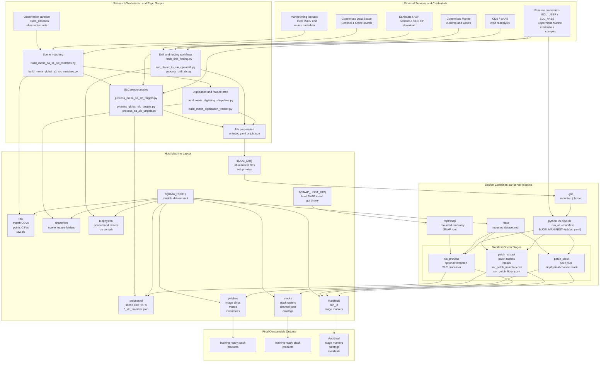

# Repository Server Architecture One-Shot Diagram

This is a standalone combined view of the repository architecture. It compresses the research workflow, server runtime, bind mounts, storage layout, and external dependencies into one Mermaid diagram.

Source companion document:

- `D:\Masters\docs\superpowers\specs\2026-07-06-repo-server-architecture-design.md`

## Combined Diagram

