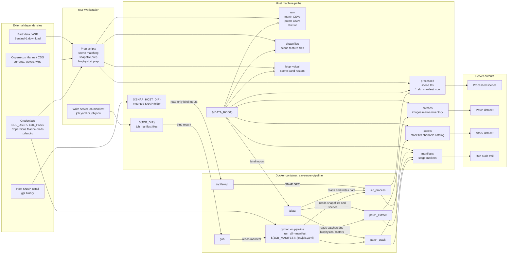

# Repository Server System Dev Diagram

This diagram is the simplified system-developer view of the server setup.

It focuses on:

- the workstation
- the host paths
- the Docker container
- the bind mounts
- the runtime dependencies
- the main data flow into and through the server

Related documents:

- `D:\Masters\docs\superpowers\specs\2026-07-06-repo-server-architecture-design.md`
- `D:\Masters\docs\superpowers\specs\2026-07-06-repo-server-architecture-one-shot-diagram.md`

## System Developer One-Shot View

