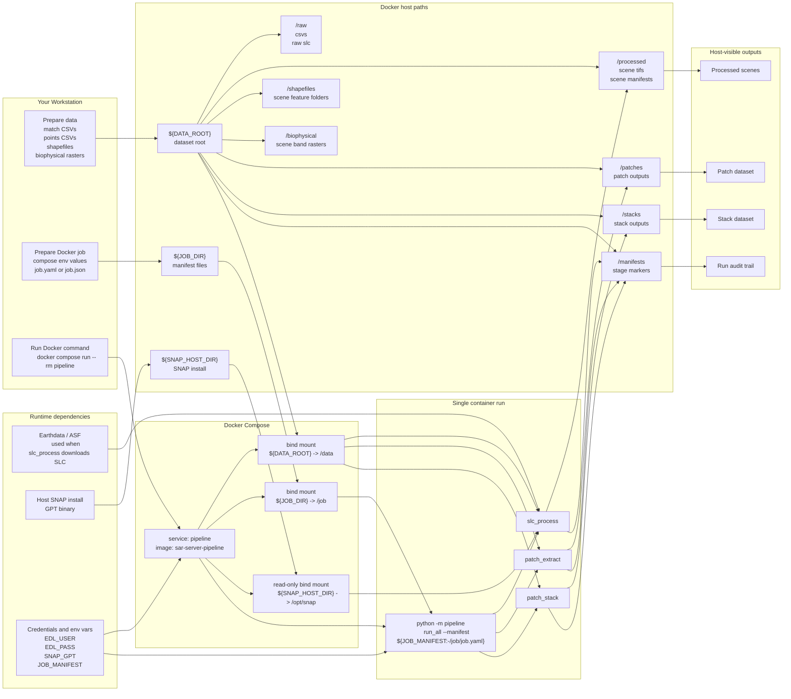

# Repository Server Docker-Native Diagram

This is a standalone Docker-native view of the system.

It intentionally describes the setup in terms of:

- your workstation
- Docker Compose
- the `pipeline` service
- the `sar-server-pipeline` image
- container bind mounts
- runtime environment variables
- host-side outputs written by the container

Related documents:

- `D:\Masters\docs\superpowers\specs\2026-07-06-repo-server-architecture-design.md`
- `D:\Masters\docs\superpowers\specs\2026-07-06-repo-server-system-dev-diagram.md`

## Docker-Native System Graph

