# Repository Server Machine Implementation Diagram

This is the high-detail Mermaid diagram for someone implementing the system on a machine.

It is intentionally technical and large. It describes:

- workstation-side preparation scripts
- host filesystem layout
- Docker Compose wiring
- image build contents
- vendored processing code inside the image
- host-mounted SNAP
- manifest loading and stage execution
- stage-specific read and write paths
- host-visible outputs and audit files

Related documents:

- `D:/Masters/docs/superpowers/specs/2026-07-06-repo-server-architecture-design.md`
- `D:/Masters/docs/superpowers/specs/2026-07-07-repo-server-docker-native-diagram.md`

## High-Detail Machine Implementation Graph

```mermaid
flowchart TB
    subgraph WS["Workstation preparation layer"]
        WS0["Repo root<br/>D:/Masters"]
        WS1["Observation and scene matching<br/>D:/Masters/Data_Creation/build_meria_sa_s1_slc_matches.py<br/>D:/Masters/Data_Creation/build_meria_global_s1_slc_matches.py<br/>writes match CSVs and point CSVs"]
        WS2["Digitisation and feature prep<br/>D:/Masters/Data_Creation/build_meria_digitising_shapefiles.py<br/>D:/Masters/Data_Creation/build_meria_digitisation_tracker.py<br/>or copy processed digitised_patches into shapefiles_root/[scene_id]/"]
        WS3["Biophysical and drift preparation<br/>D:/Masters/Domain_SSL/Scripts/Preprocessing/fetch_drift_forcing.py<br/>D:/Masters/Domain_SSL/Scripts/Preprocessing/run_planet_to_sar_opendrift.py<br/>writes per-scene rasters for later patch_stack use"]
        WS4["Local sandbox and manifest setup example<br/>D:/Masters/sar_server_pipeline/local/setup_meria_sa_004_before.ps1<br/>creates data/job roots, filtered CSVs, copied shapefiles, and a manifest file"]
        WS5["Operator command surface<br/>docker compose build<br/>docker compose run --rm pipeline<br/>docker compose run --rm pipeline patch_extract --manifest /job/job.yaml"]
    end

    subgraph EXT["External systems and credentials"]
        EXT1["Copernicus Data Space catalog<br/>used by match-building scripts to resolve Sentinel-1 candidates"]
        EXT2["Earthdata / ASF<br/>used by SLC processing when download is required"]
        EXT3["Copernicus Marine / CDS / ERA5<br/>used by workstation-side forcing and drift preparation"]
        EXT4["Credentials<br/>EDL_USER / EDL_PASS<br/>netrc or _netrc<br/>Copernicus Marine credentials<br/>.cdsapirc"]
        EXT5["Host SNAP install<br/>example host GPT path: C:/Program Files/esa-snap/bin/gpt.exe"]
    end

    subgraph HOST["Host filesystem contract"]
        HOST0["D:/Masters/outputs/sar_server_pipeline_local<br/>example local sandbox root"]
        HOST1["DATA_ROOT<br/>mounted into container as /data"]
        HOST1A["DATA_ROOT/raw<br/>match CSVs<br/>points CSVs<br/>raw/slc/"]
        HOST1B["DATA_ROOT/processed<br/>scene GeoTIFFs<br/>*_slc_manifest.json"]
        HOST1C["DATA_ROOT/shapefiles/[scene_id]/...<br/>.geojson .json .shp bundles"]
        HOST1D["DATA_ROOT/biophysical/[scene_id]/[band].tif<br/>default stack bands: uo vo swh"]
        HOST1E["DATA_ROOT/patches<br/>sar_patch_inventory.csv<br/>sar_patch_library.csv<br/>*_image.tif *_mask.tif"]
        HOST1F["DATA_ROOT/stacks<br/>stack_catalog.csv<br/>stack_dataset_manifest.json<br/>*_stack.tif *_channels.json"]
        HOST1G["DATA_ROOT/manifests/[run_id]/stages/[stage].json<br/>stage markers for success, failure, and skip behavior"]
        HOST2["JOB_DIR<br/>mounted into container as /job"]
        HOST2A["JOB_DIR/job.yaml or job.json<br/>schema_version<br/>run_id<br/>dataset_mode: sa | global<br/>targets[]<br/>inputs.match_csv<br/>inputs.points_csv<br/>inputs.raw_slc_root<br/>inputs.shapefiles_root<br/>inputs.biophysical_root<br/>outputs.processed_root<br/>outputs.patches_root<br/>outputs.stacks_root<br/>outputs.logs_root<br/>outputs.manifests_root<br/>stages.slc_process.enabled overwrite gpt graphs_dir processor_script<br/>stages.patch_extract.enabled overwrite<br/>stages.patch_stack.enabled overwrite<br/>processing.subset_mode subswaths workers cache_gb patch_size sar_band_order biophysical_bands"]
        HOST3["SNAP_HOST_DIR<br/>mounted into container as /opt/snap<br/>SNAP binaries are host-provided, not baked into the image"]
    end

    subgraph BUILD["Docker Compose and image build"]
        BUILD1["D:/Masters/sar_server_pipeline/compose.yml<br/>service: pipeline<br/>image: sar-server-pipeline<br/>command: run_all --manifest ${JOB_MANIFEST:-/job/job.yaml}"]
        BUILD2["Bind mounts declared in compose<br/>DATA_ROOT -> /data<br/>JOB_DIR -> /job<br/>SNAP_HOST_DIR -> /opt/snap (read_only)"]
        BUILD3["Container env declared in compose<br/>EDL_USER<br/>EDL_PASS<br/>SNAP_GPT default /opt/snap/bin/gpt"]
        BUILD4["D:/Masters/sar_server_pipeline/docker/Dockerfile<br/>FROM python:3.11-slim<br/>apt install gdal-bin libgdal-dev libproj-dev build-essential default-jre-headless<br/>COPY pipeline -> /app/pipeline<br/>COPY stages -> /app/stages<br/>COPY docker/snap_graphs -> /app/docker/snap_graphs<br/>COPY vendor -> /app/vendor<br/>ENTRYPOINT python -m pipeline"]
        BUILD5["Python packages installed from D:/Masters/sar_server_pipeline/requirements.txt<br/>numpy rasterio shapely affine pandas PyYAML requests fiona"]
    end

    subgraph IMAGE["Image contents available at runtime inside the container"]
        IMG1["/app/pipeline/cli.py<br/>builds subcommands: slc_process patch_extract patch_stack run_all<br/>loads manifest then dispatches run_workflow"]
        IMG2["/app/pipeline/manifest.py<br/>resolves YAML or JSON<br/>builds Inputs Outputs StageConfig ProcessingConfig Manifest"]
        IMG3["/app/pipeline/runner.py<br/>STAGE_ORDER = slc_process patch_extract patch_stack<br/>reads and writes stage markers under manifests_root/run_id/stages/"]
        IMG4["/app/stages/slc_process.py<br/>default processor path resolves to /app/vendor/Data_Creation/process_sa_slc_targets.py or process_global_slc_targets.py"]
        IMG5["/app/stages/patch_extract.py<br/>discovers scene manifests under processed_root<br/>reads shapefiles_root<br/>writes patch rasters and CSV inventories"]
        IMG6["/app/stages/patch_stack.py<br/>reads sar_patch_inventory.csv<br/>reprojects biophysical rasters from biophysical_root/[scene_id]/[band].tif<br/>writes stack rasters and channel manifests"]
        IMG7["/app/vendor/Data_Creation/process_sa_slc_targets.py<br/>/app/vendor/Data_Creation/process_global_slc_targets.py<br/>baked into the image as vendored processor scripts"]
        IMG8["/app/docker/snap_graphs/*.xml<br/>graph files copied into the image<br/>used unless overridden by manifest stages.slc_process.graphs_dir"]
        IMG9["Important split<br/>processing scripts are inside the image<br/>SNAP GPT is mounted from host /opt/snap"]
    end

    subgraph RUN["Single container execution path"]
        RUN1["docker compose run --rm pipeline<br/>starts one container from image sar-server-pipeline"]
        RUN2["python -m pipeline run_all --manifest /job/job.yaml<br/>or explicit command slc_process patch_extract patch_stack"]
        RUN3["Manifest load<br/>/app/pipeline/manifest.py reads /job manifest and resolves all configured paths"]
        RUN4["Workflow dispatch<br/>/app/pipeline/runner.py iterates enabled stages in STAGE_ORDER"]
        RUN5["Stage: slc_process<br/>reads /data/raw and target list<br/>loads vendored processor module<br/>passes --target --out-root --work-root --graphs-dir --subset-mode --subswaths --workers --cache-gb --gpt<br/>uses /opt/snap/bin/gpt when processing<br/>writes /data/processed and stage marker"]
        RUN6["Stage: patch_extract<br/>reads /data/processed scene manifests<br/>reads /data/shapefiles/[scene_id]/...<br/>builds raster bundle from scene manifest outputs<br/>writes /data/patches/[dataset_mode]/[scene_id]/[class]/...<br/>writes sar_patch_inventory.csv and sar_patch_library.csv<br/>writes stage marker"]
        RUN7["Stage: patch_stack<br/>reads /data/patches/sar_patch_inventory.csv<br/>reads /data/biophysical/[scene_id]/[band].tif<br/>writes /data/stacks/[dataset_mode]/[scene_id]/[class]/...<br/>writes stack_catalog.csv stack_dataset_manifest.json and *_channels.json<br/>writes stage marker"]
    end

    subgraph OUT["Host-visible outputs and operator inspection points"]
        OUT1["Processed scene products<br/>scene tifs and *_slc_manifest.json"]
        OUT2["Patch dataset<br/>patch images masks inventory library"]
        OUT3["Stack dataset<br/>stack rasters channel manifests stack catalog"]
        OUT4["Audit trail<br/>per-stage marker JSON files keyed by run_id"]
    end

    WS0 --> WS1
    WS0 --> WS2
    WS0 --> WS3
    WS0 --> WS4
    WS0 --> WS5

    EXT1 --> WS1
    EXT2 --> RUN5
    EXT3 --> WS3
    EXT4 --> WS1
    EXT4 --> WS3
    EXT4 --> BUILD3
    EXT4 --> RUN2
    EXT5 --> HOST3

    WS1 --> HOST1A
    WS2 --> HOST1C
    WS3 --> HOST1D
    WS4 --> HOST0
    WS4 --> HOST1
    WS4 --> HOST2
    WS5 --> BUILD1

    HOST1 --> HOST1A
    HOST1 --> HOST1B
    HOST1 --> HOST1C
    HOST1 --> HOST1D
    HOST1 --> HOST1E
    HOST1 --> HOST1F
    HOST1 --> HOST1G
    HOST2 --> HOST2A

    BUILD1 --> BUILD2
    BUILD1 --> BUILD3
    BUILD4 --> BUILD5
    BUILD4 --> IMG1
    BUILD4 --> IMG4
    BUILD4 --> IMG7
    BUILD4 --> IMG8

    HOST1 -->|bind mount| BUILD2
    HOST2 -->|bind mount| BUILD2
    HOST3 -->|read-only bind mount| BUILD2

    BUILD1 --> RUN1
    BUILD2 --> RUN1
    BUILD3 --> RUN2
    BUILD4 --> RUN1

    IMG1 --> RUN2
    IMG2 --> RUN3
    IMG3 --> RUN4
    IMG4 --> RUN5
    IMG5 --> RUN6
    IMG6 --> RUN7
    IMG7 --> RUN5
    IMG8 --> RUN5
    IMG9 --> RUN5

    RUN1 --> RUN2
    RUN2 --> RUN3
    RUN3 --> RUN4
    RUN4 --> RUN5
    RUN4 --> RUN6
    RUN4 --> RUN7

    HOST1A --> RUN5
    HOST1B --> RUN6
    HOST1C --> RUN6
    HOST1D --> RUN7
    HOST1E --> RUN7
    HOST2A --> RUN3
    HOST3 --> RUN5

    RUN5 --> HOST1B
    RUN5 --> HOST1G
    RUN6 --> HOST1E
    RUN6 --> HOST1G
    RUN7 --> HOST1F
    RUN7 --> HOST1G

    HOST1B --> OUT1
    HOST1E --> OUT2
    HOST1F --> OUT3
    HOST1G --> OUT4
```

